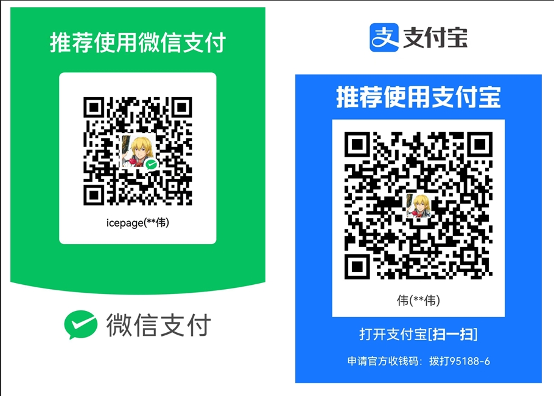

# MyJdCOOKIE

## 介绍
- 用来自动化更新青龙面板的失效JD_COOKIE, 主要有三步
    - 自动获取青龙面板的失效JD_COOKIE;
    - 拿到失效JD_COOKIE内容后, 根据配置的账号信息, 自动化登录JD页面, 拿到key;
    - 根据拿到的key, 自动化更新青龙面板的失效JD_COOKIE。
- 支持的验证码类型有：
  - 滑块验证码;
  - 形状颜色验证码(基本不会出现了);
  - 点选验证码;
  - 短信验证码,支持手动输入和webhook(首次登录大概率出现, 其它时间出现频率低。webhook配置流程繁琐, 不爱折腾的建议使用手动输入或关闭。)
- python >= 3.9 (playwright依赖的typing，在3.7和3.8会报错typing.NoReturn的BUG)
- 支持windows,linux(无GUI)
- linux无GUI使用文档请转向 [linux无GUI使用文档](https://github.com/icepage/AutoUpdateJdCookie/blob/main/README.linux.md)
- WINDOWS整体效果如下图


## 使用文档
### 安装依赖
```commandline
pip install -r requirements.txt
```

### 安装chromium插件
```commandline
playwright install chromium
```

### 添加配置config.py
- 复制config_example.py, 重命名为config.py, 我们基于这个config.py运行程序;
- user_datas为JD用户数据,按照实际信息填写;
- qinglong_data为QL数据,按照实际信息填写;
  - 建议优先选择用client_id和client_secret,获取方法如下：
  ```commandline
  1、在系统设置 -> 应用设置 -> 添加应用，进行添加
  2、需要【环境变量】的权限
  3、此功能支持青龙2.9+
  ```
  
  - 其次选择用token,需要在浏览器上，F12上获取Authorization的请求头。
  - 账号密码为最次选择, 这种方式会抢占QL后台的登录。

- auto_move为自动识别并移动滑块验证码的开关, 有时不准就关了;
- slide_difference为滑块验证码的偏差, 如果一直滑过了, 或滑不到, 需要调节下;
- auto_shape_recognition为二次图形状验证码的开关;
- headless设置浏览器是否启用无头模式，即是否展示整个登录过程，建议调试时False，稳定后True;
- cron_expression基于cron的表达式，用于schedule_main.py定期进行更新任务;
- 消息类的配置下面会说明;
- 短信验证码说明在下面会说明。

### 配置消息通知
#### 1、如果不需要发消息，请关掉消息开关，忽略消息配置
```commandline
# 是否开启发消息
is_send_msg = False
```
#### 2、成功消息和失败消息也可以开关
```commandline
# 更新成功后是否发消息的开关
is_send_success_msg = True
# 更新失败后是否发消息的开关
is_send_fail_msg = True
```

#### 3、可以发企微、钉钉、飞书机器人，其它的就自写webhook
```commandline
# 配置发送地址
send_info = {
    "send_wecom": [
        "https://qyapi.weixin.qq.com/cgi-bin/webhook/send?key="
    ],
    "send_webhook": [
        "http://127.0.0.1:3000/webhook",
        "http://127.0.0.1:4000/webhook"
    ],
    "send_dingtalk": [
    ],
    "send_feishu": [
    ]
}
```

### 短信验证码说明
#### 1、全局配置
- sms_func为填写验信验证码的模式,有以下三种
  - no 关闭短信验证码识别;
  - manual_input 手动在终端输入验证码;
  - webhook 调用api获取验证码,可实现全自动填写验证码;
- sms_webhook为的sms webhook地址;

#### 2、按账号个性配置
可以按账号配置sms_func和sms_webhook, 如果账号内没配置则会读全局配置的值
```python
  "13500000000": {
      "password": "123456",
      "pt_pin": "123456",
      "sms_func": "webhook",
      "sms_webhook": "https://127.0.0.1:3000/api/getCode"
  }
```

#### 3、调用webhook说明

##### METHOD
POST 

##### Description
获取验证码

##### Body
```json
{
    "phone_number": "13500000000"
}
```

#### Response
```json
{
    "err_code": 0,
    "message": "Success",
    "data": {
        "code": "475431"
    }
}
```

#### 4、参考项目

[SmsCodeWebhook](https://github.com/icepage/SmsCodeWebhook)


### 运行脚本
#### 1、单次手动执行
```commandline
python main.py
```

#### 2、常驻进程
进程会读取config.py里的cron_expression,定期进行更新任务
```commandline
python schedule_main.py
```

### 特别感谢
- 感谢 [所有赞助本项目的热心网友 --> 打赏名单](https://github.com/icepage/AutoUpdateJdCookie/wiki/%E6%89%93%E8%B5%8F%E5%90%8D%E5%8D%95)
- 感谢 **https://github.com/sml2h3/ddddocr** 项目，牛逼项目
- 感谢 **https://github.com/zzhjj/svjdck** 项目，牛逼项目

### 创作不易，如果项目有帮助到你，你可以打赏下作者

